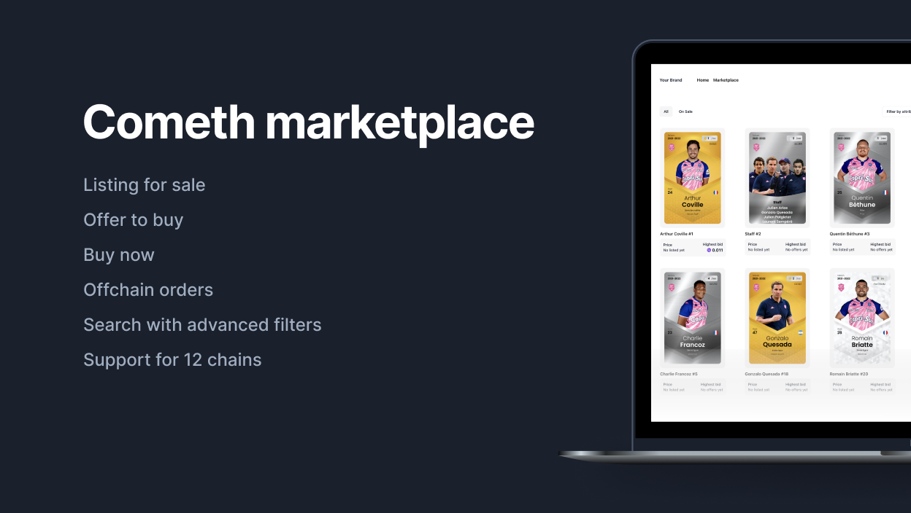

# 🚀 Getting Started with Marketplace UI

Welcome to **Marketplace UI** - your gateway to creating and publishing web3 marketplaces, powered by Next.js 13.



## Explore the Demo

Before diving in, take a look at our demo to get a glimpse of what you can achieve with Cometh Marketplace. 
[Explore the Demo Marketplace](https://starter.marketplace.develop.core.cometh.tech/marketplace).

## Setting Up Your Project

### 1. Initial Setup:

To kick things off, install the required dependencies and start the application in development mode.

```bash
# Install dependencies
yarn

# Start the application
yarn dev
```

### 2. Environment Variable Configuration
Environment variables are typed in `env.ts` and defined in the `.env` file. Ensure they are defined during both build and runtime.

Based on the provided `.env.example`, here's an example of how your `.env` file should look:

```
NEXT_PUBLIC_NODE_ENV=development
NEXT_PUBLIC_ZERO_EX_CONTRACT_ADDRESS=<CONTRACT_ADDRESS>

# Cometh
NEXT_PUBLIC_COMETH_API_URL:"https://api.marketplace.prod.core.cometh.tech/v1"
```

🔧 Please replace `<CONTRACT_ADDRESS>` with the appropriate Zero Ex contract address.
All other values are provided for you and do not need modification unless specified otherwise.


### 3. Customizing Your Marketplace
**Manifest:** The `manifest.ts` file serves as a central configuration point for your marketplace. Within it, you'll be able to adjust key details, such as:

- The name of your marketplace.
- Contract addresses.
- Asset attribute configurations.
- Network details.
- Currency settings.

🔧 **Important:** It's crucial to navigate to the `manifest.ts` file and customize these parameters to align with the specifics of your marketplace.

**Global configuration:** You can manage the configuration of your site directly from the `site.ts` file. This allows you to update metadata, links, and the site title.

```
import { manifest } from "@/manifests"

export type SiteConfig = typeof siteConfig

export const siteConfig = {
  name: `${manifest.name} | Marketplace`,
  description: `Discover ${manifest.name}, the ultimate Web3 marketplace platform.`,
  mainNav: [
    {
      title: "Home", 
      href: "/",
    },
    {
      title: "Marketplace",
      href: "/marketplace",
    },
  ],
}
```

**Theming:** The appearance of your marketplace is fully customizable via the provided CSS file.
Custom `styles/globals.css` and `tailwind.config.js` files to define colors, fonts, etc.

For a detailed understanding of each variable and its visual impact, refer to the [Figma file](https://www.figma.com/file/Zu4BtlBGkkDfCULfrPmYsk/Alembic-Marketplace-CSS?type=design&t=OW794LxppDTP8WJ2-6).